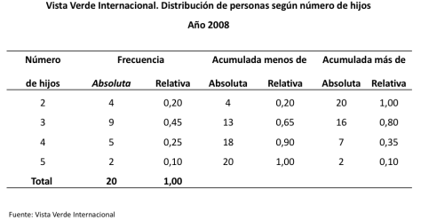
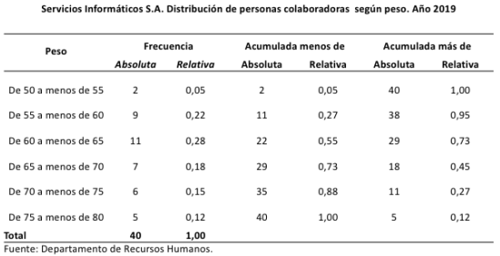

# Distribuciones de frecuencia

## Clases

Grupos en los que se distribuye la información.

- Exhaustivas: todas las observaciones deben ser incluidas en alguna de las clases
- Mutuamente excluyentes: una observación no puede ser incluida en más de una clase.

### Frecuencia absoluta
Número de observaciones presentes en cada clase. Llamada frecuencia
### Frecuencia relativa
Es el valor que se obtiene de dividir la frecuencia absoluta entre el número total de datos u observaciones. Se expresan en términos porcentuales.
### Frecuencias acumuladas
Se utilizan para conocer el número de observaciones mayores o menores que cierto valor de clase.

#### Ejemplo:

> Enunciado: A continuación se brinda información acerca del número de hijos de un grupo de 20 personas colaboradoras de la empresa Vista Verde Internacional en el año 2008.

> hijos <- c(2,3,3,2,5,3,4,3,4,3,2,2,4,3,5,3,3,4,3,4)

#### Interpretaciones:

- 45 % de las personas tienen 3 hijos.
- 65 % de las personas tienen menos de 4 hijos.
- 80 % de las personas tienen más de 2 hijos.

### Representación gráfica

Las distribuciones de este tipo de variables se pueden representar por medio de un gráfico de bastones o un gráfico de barras verticales.

### Tipos de redondeo
- Redondeo usual (a la unidad más próxima)
- Redondeo hacia arriba.
- Redondeo hacia abajo.

#### Redondeo usual
Mayor a 5 exacto, se aumenta una unidad

|Original|Redondeo
|:--:|:--:|
|137,502 -> |138
|42,650 -> |43

#### Redondeo hacia arriba.
Se conserva el último dígito y el resto se elimina

|Original|Redondeo
|:--:|:--:|
|137,502 -> |137
|42,650 -> |42
|42,000 -> |42

#### Redondeo hacia abajo.
Último dígito se aumenta una unidad, excepto cuando va seguido de ceros

|Original|Redondeo
|:--:|:--:|
|137,502 -> |138
|42,650 -> |43
|42,020 -> |43
|42,000 -> |42

### Límites de clase
Son los valores que definen una clase, separándola de la anterior y de la posterior.
### Intervalo de clase
Indica la amplitud de la clase y se obtiene de la diferencia del límite real superior y el límite real inferior.
### Punto medio
Se refiere al valor central de cada clase, el cual se obtiene al promediar los límites reales.
### Clases abiertas
Se ubican al principio o al final de la distribución con el fin de incorporar todos aquellos datos que se apartan mucho,

## Ejemplo Límites de los pesos
|Rangos|
|:---:|
|50-55
|55-60
|60-65
|65-70
|70-75
|75-80

