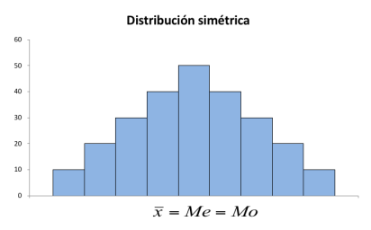
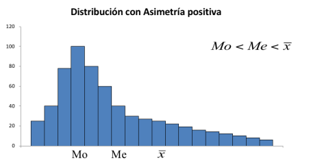
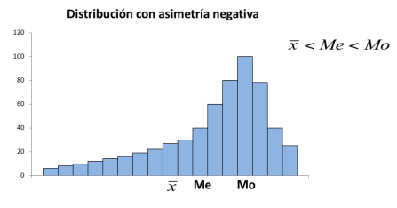

# Medidas estadísticas

Se definen medidas que se obtienen con el fin de describir la tendencia central y la dispersión de un conjunto de datos.

> Los conceptos con los cuales se trabaja tienen interpretación tanto si se trata de una muestra como si se trata de una población finita de datos. En el caso de que los datos provengan de una **población**, estas medidas se denominan **parámetros**; si la información proviene de una **muestra**, se denominan **estadísticos**.

## Promedio
El promedio se define como $$\bar{x} = \frac{\sum_{i=1}^{n} x_i}{n}$$

> Es la medida de tendencia central más usada y conocida; en general, cuando se hable de "promedio" se estará haciendo referencia a ella.

En el caso de una población finita se denota como $$\mu = \frac{\sum_{i=1}^{N} x_i}{N}$$

### Ejemplo:
> Suponga que las notas de un grupo de estudiantes del curso de matemática general son las siguientes: 70; 77; 65; 64,2; 58,7; 69,5 y 74,6. Determine e interprete la nota promedio del grupo.

El cálculo resulta en $\bar{x} = \frac{70 + 77 + 65 + 64.2 + 58.7 + 69.5 + 74.6}{7} = 68.4$ para este caso. **Interpretación:** la nota promedio del grupo de estudiantes del curso de matemática general es de 68,4.

### Ejemplo adicional:
> Suponga que el índice de masa corporal de un grupo de personas (en kg/m²) está dado por: 24, 26, 27, 29, 31, 33, 35, 33. Determine e interprete el índice de masa corporal promedio del grupo.

---

**Media ponderada:** Dada una muestra de n observaciones $x_1, x_2, ..., x_n$ para las cuales existe $w_1, w_2, ..., w_n$ tal que $w_i$ representa la ponderación de cada $x_i$, se llama media o promedio aritmético ponderado del conjunto de datos a la expresión, denotada por $\bar{x}_w$, que se calcula como:

$$\bar{x}_w = \frac{\sum_{i=1}^{n} (x_i \cdot w_i)}{\sum_{i=1}^{n} w_i}$$

> A diferencia del promedio simple, la media ponderada le asigna mayor o menor importancia a cada dato según el peso (ponderación) que se le indique; se usa cuando no todas las observaciones tienen la misma relevancia dentro del cálculo (por ejemplo, cuando cada examen de un curso tiene un porcentaje distinto de la nota final).

### Ejemplo:
> Suponga que la nota del curso de Probabilidad y Estadística está distribuida de la siguiente manera I Parcial: 20 %, II Parcial: 25 %, III Parcial 30 %, Pruebas Cortas: 10 % y Tareas 15 %.
> Si una persona obtiene las siguientes calificaciones I parcial: 50, II parcial: 70; III parcial: 80, Pruebas cortas: 60, tareas: 90. ¿Cuál es su nota promedio?

El cálculo final da como resultado $\bar{x}_w = \frac{50 \cdot 20 + 70 \cdot 25 + 80 \cdot 30 + 60 \cdot 10 + 90 \cdot 15}{20 + 25 + 30 + 10 + 15} = 71$ para esta muestra.

## Mediana
Se define como el valor central de una serie de datos ordenados, o como un valor tal que no más de la mitad de las observaciones son menores que él y no más de la mitad son mayores; es decir, indica que el 50 % de las observaciones son menores o iguales que ella y el otro 50 % son mayores o iguales a ella.

### N impar
> La posición de la mediana cuando los datos están ordenados se encuentra en:
$$M_e = x_{\frac{n+1}{2}}$$

#### Ejemplo:
> Supongamos que las notas de siete estudiantes son 55,60, 68, 72, 76, 80, 90. Calcule e interprete la mediana.

El cálculo resulta en $M_e = x_{\frac{n+1}{2}} = x_{\frac{7+1}{2}} = x_4 = 72$ para este caso. **Interpretación:** el 50 % del estudiantado obtuvo notas menores o iguales a 72 y el 50 % obtuvo notas mayores o iguales a 72.

### N par
> La mediana es igual al promedio de los datos en la posición n/2 y n/(2 + 1).
$$M_e = \frac{x_{\frac{n}{2}} + x_{\frac{n}{2} + 1}}{2}$$

#### Ejemplo:
> Suponga que se tiene información de las notas de un grupo de estudiantes: 55, 60, 68, 72, 76, 80, 90, 93. Calcule e interprete la mediana.

El cálculo resulta en $M_e = \frac{x_4 + x_5}{2} = \frac{72 + 76}{2} = 74$ para este caso. **Interpretación:** el 50 % del estudiantado obtuvo notas menores o iguales a 74 y el 50 % obtuvo notas mayores o iguales a 74.

## Moda
La moda se define como el valor al cual corresponde la mayor frecuencia, es decir el valor más común o popular dentro del conjunto de datos. La moda se puede aplicar tanto para datos cuantitativos como cualitativos.

> **Bimodal:** cuando existen dos valores con la misma frecuencia máxima. **Multimodal:** cuando existen 3 o más valores con la misma frecuencia máxima, caso en el cual la moda deja de ser útil como medida de tendencia central (pierde su capacidad de resumir un único valor representativo).

### Ejemplos:

#### Ejemplo 1
> Suponga que las Notas de un grupo de estudiantes están dadas por: 5, 7, 7, 8, 8, 8, 9. Calcule e interprete la moda.

La moda resulta $M_o = 8$ para este caso. La nota más común entre el estudiantado es 8.

#### Ejemplo 2
> Suponga que el estado civil de un grupo de estudiantes están dadas por: C, S, S, S, S, C, V. Calcule e interprete la moda.

La moda resulta $M_o = S$ para este caso. El estado civil más común entre el estudiantado es soltero.

#### Ejemplo 3
> Suponga que se cuenta con información sobre la cantidad de horas semanales de estudio independiente que dedica un grupo de estudiantes. Determine e interprete, si existe, la moda del conjunto de datos.

| Horas | Cantidad |
|:---:|:---:|
| 10 | 3 |
| 12 | 4 |
| 13 | 5 |
| 14 | 2 |
| 15 | 4 |

> La moda resulta $M_o = 13$, ya que es el valor con mayor frecuencia (5 estudiantes). La cantidad de horas semanales de estudio independiente más común entre el estudiantado es 13.

#### Ejemplo integrador (Media, Moda y Mediana)
> A continuación se brinda información del monto (en miles de colones) por concepto de impuestos municipales que canceló un grupo de 40 personas en la Municipalidad de Barva durante el mes de julio de 2025. Determine e interprete la media, la moda y la mediana.

```
monto <- c(43, 40, 22, 28, 36, 22, 29, 29, 41, 26, 22,
           31, 21, 23, 20, 35, 21, 28, 44, 25, 30, 29,
           43, 29, 26, 33, 29, 32, 30, 26, 22, 25, 20,
           23, 23, 42, 27, 32, 23, 31)
```

## Observaciones
* La media y la mediana pueden no pertenecer al conjunto de los datos.
* La moda, si existe, pertenece al conjunto de los datos.
* La media no tiene sentido en el caso de variables cualitativas.
* La mediana puede obtenerse en datos cualitativos de naturaleza ordinal.
* En el cálculo de la moda y la mediana no se incluyen todos los valores de la variable.
* La moda y la mediana no se ven afectadas por la presencia de valores extremos.

## Cuantilos
Valores que dividen al conjunto de datos en fracciones específicas. Para su cálculo los datos deben estar ordenados.

### Tipos
* Cuartiles
* Quintiles
* Deciles
* Percentiles

### Cuartiles
Los cuartiles dividen al conjunto de datos en 4 grupos de modo que cada grupo reúne el 25 % de las observaciones.

|x1|25%|C1|25%|C2|25%|C3|25%|xn|
|:--:|:--:|:--:|:--:|:--:|:--:|:--:|:--:|:--:|

### Quintiles
Los quintiles dividen al conjunto de datos en 5 grupos de modo que cada grupo reúne el 20 % de las observaciones.

|x1|20%|Q1|20%|Q2|20%|Q3|20%|Q4|20%|xn|
|:--:|:--:|:--:|:--:|:--:|:--:|:--:|:--:|:--:|:--:|:--:|

### Deciles
Los deciles dividen al conjunto de datos en 10 grupos de modo que cada grupo reúne el 10 % de las observaciones.

|x1|10%|D1|10%|D2|10%|D3|10%|D4|10%|D5|10%|D6|10%|D7|10%|D8|10%|D9|10%|xn|
|:--:|:--:|:--:|:--:|:--:|:--:|:--:|:--:|:--:|:--:|:--:|:--:|:--:|:--:|:--:|:--:|:--:|:--:|:--:|:--:|:--:|

### Percentiles
Si m es un valor tal que 1 ≤ m ≤ 99 entonces definimos el percentil m a la expresión denotada por $P_m$ tal que:

$$P_m = x_{\frac{m}{100}(n+1)}$$

El $P_m$ está dado por el $m(n+1)/100$ término de la distribución.
El $P_m$ es una medida tal que el m % de los datos son menores o iguales a él y el (100 − m) % de los datos son mayores o iguales a él.

|x1|m%|Pm|(100-m)%|xn
|:--:|:--:|:--:|:--:|:--:|

#### Ejemplo

##### Ejemplo 1:
> Suponga que se tiene información de las notas de un grupo de estudiantes (55, 60, 68, 72, 76, 80, 90, 93). Calcule e interprete el percentil 25.

$$P_{25} = x_{\frac{25}{100}(8+1)} = x_{2.25} \implies x_2 \le x_{2.25} \le x_3 \implies 60 \le P_{25} \le 68$$
$$\frac{68 - 60}{3 - 2} = \frac{P_{25} - 60}{2.25 - 2} \implies 8(0.25) + 60 = P_{25} \implies P_{25} = 62$$

El 25 % del estudiantado obtuvo una nota de menor o igual a 62 y el 75 % obtuvo una nota mayor o igual a 62.

##### Ejemplo 2:
> Suponga que se tiene información de las notas de un grupo de estudiantes (55, 60, 68, 72, 76, 80, 90, 93). Calcule e interprete el percentil 70.

$$P_{70} = x_{\frac{70}{100}(8+1)} = x_{6.3} \implies x_6 \le x_{6.3} \le x_7 \implies 80 \le P_{70} \le 90$$
$$\frac{90 - 80}{7 - 6} = \frac{P_{70} - 80}{6.3 - 6} \implies 10(0.30) + 80 = P_{70} \implies P_{70} = 83$$

El 70 % del estudiantado obtuvo una nota de menor o igual a 83 y el 30 % obtuvo una nota mayor o igual a 83.

## Distribución
> El propósito fundamental de las medidas de posición es caracterizar y representar un conjunto de datos. De acuerdo con la forma de la distribución de los datos, esta puede ser simétrica o asimétrica.

### Simétrica


> Cuando la distribución es simétrica, se cumple que: $\bar{x} = M_e = M_o$

### Asimétrica

#### Positiva


> Distribución con valores extremos altos, donde se cumple que: $M_o < M_e < \bar{x}$

#### Negativa


> Distribución con valores extremos bajos, donde se cumple que: $\bar{x} < M_e < M_o$

### Usos
* La media es un valor sensible a la presencia de valores extremos dentro del conjunto de los datos.
* No es recomendado el uso de la media en presencia de distribuciones muy asimétricas.
* La mediana y la moda no son sensibles a la presencia de estos valores extremos.
* En distribuciones asimétricas, la moda puede no ser un valor central de la distribución.

## Variabilidad
Es la razón de ser de la Estadística. Se define como las diferencias que muestra cada observación de un conjunto de datos respecto a un valor típico determinado para resumirlos o representarlos.

Medidas más comunes:
* Rango o recorrido
* Rango intercuartílico
* Desviación media
* Varianza o variancia
* Desviación estándar

### Rango o recorrido
$$R = \text{Obs. Mayor} - \text{Obs. Menor}$$

> Es la medida de dispersión más sencilla de calcular, pero también la más limitada: solo toma en cuenta los dos valores extremos del conjunto de datos, ignorando por completo cómo se distribuyen las observaciones intermedias, por lo que es muy sensible a valores atípicos.

### Rango intercuartílico
$$RI = P_{75} - P_{25}$$

> El rango intercuartílico reúne el 50 % central de los datos.

|x1|25%|P25|50%|RI|P75|25%|xn|
|:--:|:--:|:--:|:--:|:--:|:--:|:--:|:--:|

### Desviación media
Es una medida de dispersión promedio. Normalmente se denota por DM y se define por:
$$DM = \frac{\sum_{i=1}^{n} |x_i - \bar{x}|}{n}$$

> Es muy poco utilizada debido al uso del valor absoluto y por la existencia de otra medida (la varianza) que resulta más cómoda y útil, y que reúne mayores ventajas prácticas y teóricas.

### Varianza
La **varianza poblacional** se denota por $\sigma^2$ y se define por:
$$\sigma^2 = \frac{\sum_{i=1}^{N} (x_i - \mu)^2}{N} = \frac{\sum_{i=1}^{N} x_i^2 - \frac{\left(\sum_{i=1}^{N} x_i\right)^2}{N}}{N}$$

donde:
* $x_i$ representa cada observación del conjunto de datos.
* $N$ representa el total de datos de la población.

La **varianza muestral** se denota por $s^2$ y se define por:
$$s^2 = \frac{\sum_{i=1}^{n} (x_i - \bar{x})^2}{n-1} = \frac{\sum_{i=1}^{n} x_i^2 - \frac{\left(\sum_{i=1}^{n} x_i\right)^2}{n}}{n-1}$$

donde:
* $x_i$ representa cada observación del conjunto de datos.
* $n$ representa el total de datos de la muestra.

> **Nota conceptual:** la varianza mide, en promedio, qué tan alejadas están las observaciones respecto a la media, pero al elevar las diferencias al cuadrado, el resultado queda expresado en unidades al cuadrado (por ejemplo, "puntos²"), lo que dificulta su interpretación directa; por eso se recurre a la desviación estándar, que devuelve el resultado a las unidades originales.
> **¿Por qué n-1 en la varianza muestral?** Se utiliza n-1 (llamados "grados de libertad") en lugar de n para corregir el sesgo que se produce al estimar la varianza poblacional a partir de una muestra, ya que dividir entre n tendería a subestimar la variabilidad real de la población.

#### Ejemplo:
> Suponga que se tiene información de las notas de un grupo de estudiantes (55, 60, 68, 72, 76, 80, 90, 93). Calcule la varianza de los datos.

El promedio del conjunto de datos está dado por 74,25.
$$s^2 = \frac{(55-74,25)^2 + (60-74,25)^2 + ... + (93-74,25)^2}{8-1} = 179,07$$

### Desviación estándar
Mide la dispersión (cuánto se alejan en promedio) de las observaciones respecto de la media aritmética del conjunto.

La **desviación estándar poblacional** se denota por $\sigma$ y se define por:
$$\sigma = \sqrt{\sigma^2}$$

La **desviación estándar muestral** se denota por $s$ y se define por:
$$s = \sqrt{s^2}$$

#### Ejemplo:
> Suponga que se tiene información de las notas de un grupo de estudiantes (55, 60, 68, 72, 76, 80, 90, 93). Calcule e interprete la desviación estándar de los datos.

La varianza de los datos está dada por 179,07, por lo que la desviación estándar está dada por:
$$s = \sqrt{179,07} = 13,38$$

**Interpretación:** las notas varían en promedio 13,38 puntos con respecto a la nota media.

---

## El diagrama de cajas
Es una representación geométrica que permite visualizar varias características de la distribución de los datos, tales como la simetría y la variabilidad. También permite la identificación de **valores atípicos** en un conjunto de datos.

> Para su construcción se requiere el valor mínimo, máximo, y los percentiles 25, 50 (mediana) y 75.

### Ejemplo
> Considere el siguiente conjunto de datos relacionados con el salario mensual de un grupo de 40 personas colaboradoras de la empresa Servicios Informáticos S.A. Construya el diagrama de cajas.

```
161 179 190 218 236 243 259 260 278 281
287 288 289 290 291 292 305 314 314 320
321 326 333 333 333 345 345 349 350 358
372 374 380 400 400 426 428 436 450 501
```

El diagrama resultante muestra una caja delimitada entre el percentil 25 (285,5) y el percentil 75 (361,5), con la mediana en 320,5; los bigotes se extienden hasta 179,0 y 450,0, y aparecen dos valores atípicos (círculos) por debajo y por encima de dichos límites, correspondientes a 161 y 501.

### Interpretación general del diagrama
* **Variabilidad:** se identifica por medio de la longitud de la caja; entre más pequeña sea esta, menor variabilidad presenta el conjunto de los datos.
* **Forma (simetría o asimetría):** se observa a partir de qué tan centrada está la mediana, o qué tan cerca se encuentra del percentil 25 o 75.
  * Si la mediana se encuentra en el centro (o cerca de él), la distribución es **simétrica** o aproximadamente simétrica.
  * Si la mediana se encuentra muy cercana al percentil 25, la distribución es **asimétrica positiva**.
  * Si la mediana se encuentra muy cercana al percentil 75, la distribución es **asimétrica negativa**.

### Ejemplo diagrama de cajas


---

## Medidas estadísticas: Variabilidad relativa

### Coeficiente de variación
* Es una medida de **dispersión relativa**.
* Indica la importancia de la desviación estándar en relación con el promedio aritmético.
* Indica el nivel de **homogeneidad** de un conjunto de datos.
* Permite realizar **comparaciones entre grupos de datos**, incluso cuando estos tienen unidades o magnitudes distintas.

> **Diferencia clave con la varianza/desviación estándar:** estas últimas son medidas de **dispersión absoluta**, expresadas en las mismas unidades que los datos originales, por lo que no permiten comparar directamente la variabilidad entre dos conjuntos de datos con unidades distintas (por ejemplo, kilogramos vs. colones) o con promedios muy diferentes en magnitud. El coeficiente de variación, al ser adimensional (se expresa en porcentaje), resuelve este problema.

En el caso de la muestra, se define como:
$$CV = \frac{s}{\bar{x}} \cdot 100$$

### Ejemplo:
> Considere los datos que se muestran a continuación, relativos al rendimiento promedio de dos grupos en un curso de Estadística. ¿Cuál conjunto presenta mayor variabilidad relativa en cuanto a la característica rendimiento en el curso de Estadística?
> * Grupo 1: promedio = 76, desviación = 5
> * Grupo 2: promedio = 82, desviación = 10

**Solución:**
$$CV_1 = \frac{5}{76} \cdot 100 = 6,57\%$$
$$CV_2 = \frac{10}{82} \cdot 100 = 12,20\%$$

**Interpretación:** el Grupo 2 muestra mayor variabilidad relativa en relación con la variable rendimiento; es decir, los datos del Grupo 2 son más heterogéneos que los del Grupo 1. El Grupo 1 muestra menor variabilidad relativa, es decir, sus datos son más homogéneos que los del Grupo 2.
